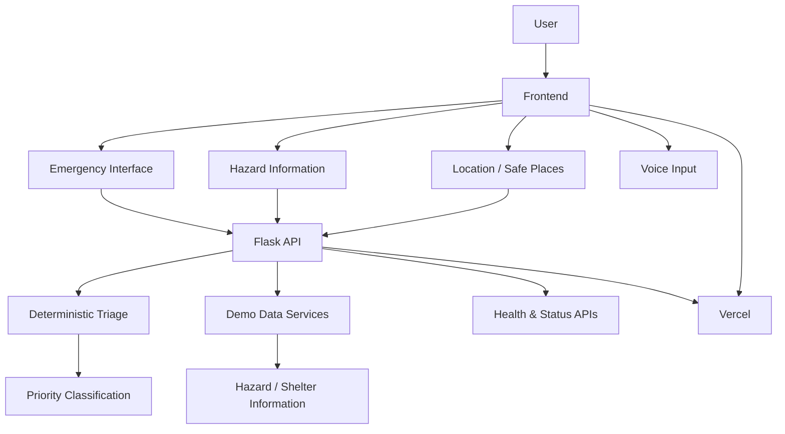

<div align="center">

# 🌊 Aapda Saathi

### आपदा साथी — Multi-Hazard Emergency Assistance

**A problem-first emergency assistance web prototype designed around clarity, structured information and rapid action during disasters.**

<br>

[
[](https://www.python.org/)
[](https://flask.palletsprojects.com/)
[](https://developer.mozilla.org/en-US/docs/Web/JavaScript)
[](#-project-status)

<br>

### 🌐 [Open Live Demo](https://aapda-saathi-naypmrd8s-utkc1507-collabs-projects.vercel.app)

</div>

---

## ⚠️ Important: This Is a Demonstration Project

**Aapda Saathi is a student-built prototype using simulated demonstration data.**

It is **not connected to government emergency systems, hospitals, NGOs, rescue agencies, weather authorities or real-time emergency infrastructure.**

The purpose of this project is to explore how software could be designed around emergency communication, structured reporting and rapid decision support.

**Do not use the prototype for real-world emergency decisions.**

---

# 🌏 Why Aapda Saathi?

> **Disasters do not wait for technology to be ready.**

Floods, earthquakes, droughts, tsunamis and other natural hazards are recurring realities across the Indian subcontinent and South Asia.

Their consequences extend far beyond the immediate event. Communities can face disrupted communication, damaged infrastructure, displacement, loss of livelihoods and difficulty accessing reliable information.

A major disaster in Nepal in 2026 particularly influenced my thinking while developing this project.

Seeing how quickly a disaster can disrupt communication, mobility and access to essential information led me to a simple question:

### **What if technology could make emergency information more structured, understandable and actionable when people need it most?**

That question became the starting point for **Aapda Saathi**.

As a **second-year Computer Science & Data Science student**, I wanted to test my web-development skills through something beyond a conventional tutorial, landing page or CRUD application.

So I chose a problem-first approach:

**Real-world problem → Product idea → Engineering decisions → Working prototype → Testing → Deployment**

Aapda Saathi is my exploration of what a thoughtfully designed emergency-assistance system could look like.

It is **not a claim to solve disaster management**.

It is an attempt to engineer around a meaningful problem.

---

# 🧭 The Core Idea

During an emergency, information can become overwhelming.

People may have:

* limited connectivity
* incomplete information
* difficulty explaining what is happening
* multiple people requesting help simultaneously
* uncertainty about where to go
* difficulty understanding what information matters most

Aapda Saathi explores a different approach:

> **When a crisis becomes complicated, the information people receive should become clearer — not more complicated.**

The prototype therefore focuses on:

**Report → Understand → Prioritise → Inform → Act**

rather than simply presenting a collection of emergency information.

---

# 🌊 What Makes Aapda Saathi Different?

### 01 — Problem-first design

The interface is designed around emergency scenarios rather than around technical features.

The goal is not to demonstrate how many technologies can be connected.

The goal is to ask:

> **What information would actually help a person understand their situation?**

---

### 02 — Flood-first, but multi-hazard

Flooding is treated as the primary demonstration scenario while the system is structured around multiple hazards:

| Hazard              | Demonstration Focus                 |
| ------------------- | ----------------------------------- |
| 🌊 Flood            | Rising-water / assistance reporting |
| 🏔️ Landslide       | Terrain and rainfall-related risk   |
| 🌪️ Cyclone / Storm | Wind and storm preparedness         |
| 🌍 Earthquake       | Preparedness information            |
| ☀️ Heatwave         | Elevated heat conditions            |
| ⚡ Lightning         | Weather-related risk                |

This creates a foundation that can conceptually expand without redesigning the entire product.

---

### 03 — Deterministic emergency triage

Aapda Saathi does **not** allow an AI model to decide whether an emergency is critical.

The current prototype uses deterministic rules for its demonstration triage.

For example, emergency indicators can result in a higher priority classification.

This makes the behaviour:

* predictable
* inspectable
* testable
* easier to reason about

AI can assist development, but the core demonstration logic remains understandable.

---

### 04 — Thinking about the people who cannot easily report

A conventional emergency application assumes that everyone can communicate.

Real emergencies are not always that convenient.

Aapda Saathi explores ideas such as:

* silent households
* duplicate reports
* constrained connectivity
* queued requests
* location-aware assistance
* responder-oriented information

Some of these are currently represented as prototype concepts rather than production infrastructure.

---

### 05 — Designed for clarity under pressure

The visual system deliberately prioritises:

**Clarity → Hierarchy → Action**

instead of filling the screen with information.

The interface attempts to answer three questions quickly:

> **What is happening?**

> **What should I do?**

> **How can I report what I am experiencing?**

---

# 🖥️ The Experience

Aapda Saathi is structured around several connected experiences.

### 🏠 Emergency Landing Experience

The landing page introduces the system through:

* hazard awareness
* emergency actions
* geographic context
* visual signals
* responsive design
* mobile-oriented interaction

---

### 🚨 Situation Reporting

Users can describe what is happening in natural language.

The prototype then processes the message through deterministic triage logic and returns a simulated priority classification.

Example:

> “We are trapped and need help.”

The prototype can identify this as a **critical** request.

---

### 🗺️ Location & Safe-Place Concept

The project includes a demonstration model for:

* location awareness
* nearby safe places
* relief centres
* shelters
* distance information

These locations are **simulated demonstration data**.

---

### 📡 Control Centre Concept

The project also explores the responder side of emergency communication.

Instead of only thinking about the person requesting help, the system considers how structured information could eventually be surfaced to a response team.

---

# ⚙️ Core Features

* 🌊 Multi-hazard emergency interface
* 🚨 Emergency situation reporting
* 🧠 Deterministic request triage
* 🎙️ Voice-based reporting prototype
* 📍 Location-aware assistance concept
* 🗺️ Safe-place / shelter demonstration
* 🔎 Structured hazard information
* 📡 Control-centre concept
* 📴 Constrained-connectivity thinking
* 🔁 Duplicate-request detection concept
* 🏠 Silent-household detection concept
* 🌐 Responsive web interface
* 📱 Mobile-oriented emergency experience
* ♿ Reduced-motion considerations
* 🌍 Multi-language interface foundation
* 🧪 Automated backend tests
* ☁️ Production deployment on Vercel

---

# 🧠 Engineering Approach

One of the main goals of this project was not simply to make a visually impressive website.

I wanted to understand the engineering decisions behind the experience.

The architecture therefore separates:

### Frontend

A lightweight browser application built with:

* HTML
* CSS
* Vanilla JavaScript
* ES modules
* responsive UI
* Progressive Web App concepts

### Backend

A Python Flask application providing:

* API routes
* deterministic triage
* demonstration data
* health checks
* safe-place data
* request handling

### Deployment

The application is deployed using:

* Vercel
* Python serverless functions
* GitHub-based deployment workflow

---

# 🏗️ Architecture



---

# 🛠️ Technology Stack

| Layer           | Technology                         |
| --------------- | ---------------------------------- |
| Frontend        | HTML5, CSS3, Vanilla JavaScript    |
| Backend         | Python, Flask                      |
| Validation      | Pydantic                           |
| API             | REST-style Flask endpoints         |
| CORS            | Flask-CORS                         |
| Testing         | Pytest                             |
| Deployment      | Vercel                             |
| Version Control | Git + GitHub                       |
| Development     | macOS + Python virtual environment |

### Planned / Future Integrations

The architecture can later be extended with services such as:

* Supabase / PostgreSQL
* authentication
* persistent incident storage
* real weather feeds
* geospatial services
* OpenStreetMap / Leaflet
* official hazard information
* carefully constrained AI assistance

These are **future directions, not claims about the current prototype.**

---

# 🔌 API Surface

The current backend exposes a small, deliberately understandable API.

| Endpoint               | Purpose                       |
| ---------------------- | ----------------------------- |
| `GET /`                | Serves the main application   |
| `GET /api/health`      | Backend health check          |
| `GET /api/hazards`     | Demonstration hazard data     |
| `GET /api/safe-places` | Demonstration safe-place data |
| `GET /api/demo-status` | Demonstration system status   |
| `POST /api/requests`   | Processes emergency reports   |

Example request:

```json
{
  "message": "We are trapped and need help"
}
```

Example response:

```json
{
  "status": "accepted",
  "mode": "demo",
  "request": {
    "message": "We are trapped and need help",
    "priority": "CRITICAL",
    "reason": "Message contains a critical safety indicator."
  }
}
```

---

# 🧪 Testing & Verification

The project was not treated as complete simply because the webpage loaded.

I used multiple layers of verification:

### Automated testing

```bash
python3 -m pytest -q
```

The current backend test suite passes.

### Manual testing

I also verified:

* homepage loading
* hazard interactions
* emergency form behaviour
* API responses
* priority classification
* voice interaction
* responsive interface behaviour
* deployment behaviour

### Deployment debugging

The production deployment initially exposed a missing dependency:

```text
ModuleNotFoundError: No module named 'flask_cors'
```

The issue was traced to a dependency that existed locally but had not been declared for production.

After adding the dependency and redeploying, the production deployment became operational.

This was an important lesson:

> **Local success does not automatically mean production readiness.**

---

# 🤖 How This Was Built

Aapda Saathi is an **AI-assisted, human-directed and human-verified** project.

I used AI as a development accelerator, not as a substitute for understanding or decision-making.

### What I decided

* Chose the overall problem and product direction.
* Chose a flood-first approach within a broader multi-hazard system.
* Defined the user experience.
* Chose deterministic triage for emergency priority.
* Explored constrained-connectivity and silent-household scenarios.
* Directed the visual and technical iteration.
* Tested and verified the resulting application.

### Where AI helped

AI was used for:

* project planning
* architecture discussions
* boilerplate development
* implementation drafts
* UI exploration
* debugging guidance
* documentation
* development iteration

### How I verified the work

I:

* reviewed generated code
* ran automated tests
* performed browser testing
* investigated deployment failures
* reproduced implementation problems
* fixed dependency issues
* verified the production deployment

### What I learned

AI-generated code can contain:

* missing dependencies
* incorrect assumptions
* environment-specific problems
* implementation bugs

Using AI effectively therefore requires the ability to **read, question, test and verify the output.**

---

# 🎓 Why I Built This

I am currently a **second-year Computer Science & Data Science student**.

I wanted to move beyond simply following tutorials and test whether I could take a problem from an initial idea through:

```text
Problem
   ↓
Research & Ideation
   ↓
Product Direction
   ↓
Technical Architecture
   ↓
Implementation
   ↓
Testing
   ↓
Debugging
   ↓
Deployment
```

Aapda Saathi became an opportunity to practise that complete cycle.

The project allowed me to work across:

* frontend development
* backend development
* API design
* product thinking
* user experience
* debugging
* deployment
* testing
* documentation

More importantly, it pushed me to think about **why** a feature should exist before thinking about **how** to implement it.

---

# 💡 What This Project Taught Me

### 1. Building a product is different from building a page

A visually attractive interface is only one part of a useful product.

The harder questions are:

> Who is using it?

> What problem are they facing?

> What information do they need?

> What happens when something fails?

---

### 2. Simplicity becomes more important as the situation becomes more complex

Emergency scenarios already contain cognitive pressure.

Adding more information does not necessarily make a system more useful.

Good design sometimes means deciding **what not to show.**

---

### 3. Deterministic systems can be valuable

Not every problem requires an AI model.

For emergency prioritisation in this prototype, deterministic logic provides a transparent baseline that can be inspected and tested.

---

### 4. Deployment is part of development

A project is not finished when it works on localhost.

It has to survive:

**Build → Environment → Dependencies → Deployment → Verification**

---

# ⚠️ Current Limitations

Aapda Saathi is intentionally presented as a prototype.

It currently does **not** provide:

* real emergency dispatch
* verified government data
* live rescue coordination
* real hospital availability
* guaranteed hazard predictions
* production-scale infrastructure
* real-time responder networks
* verified evacuation routes
* guaranteed GPS accuracy
* real disaster alerts

The safe-place and hazard information currently shown by the application is demonstration data.

---

# 🚀 Future Direction

If developed beyond the prototype stage, the system could evolve toward:

### Data

* verified government hazard feeds
* weather and rainfall data
* seismic information
* river-level information
* satellite-derived signals

### Infrastructure

* PostgreSQL / Supabase
* authentication
* persistent incident records
* role-based responder access
* audit logs

### Geospatial Intelligence

* real maps
* geocoded incidents
* dynamic safe-place routing
* affected-area visualisation
* geographic clustering

### Communication

* SMS fallback
* offline-first workflows
* queued reports
* multilingual voice interaction
* accessibility-first emergency communication

### Intelligence

AI could potentially assist with:

* multilingual understanding
* summarising incident reports
* duplicate detection
* extracting structured information

But safety-critical decisions should remain **transparent, constrained and independently verifiable.**

---

# 📁 Project Structure

```text
aapda_saathi/
│
├── api/
│   └── index.py
│
├── backend/
│   ├── app.py
│   ├── routes/
│   │   └── requests.py
│   │
│   └── services/
│       ├── demo_data.py
│       └── triage.py
│
├── frontend/
│   ├── index.html
│   │
│   ├── css/
│   │   └── design.css
│   │
│   └── js/
│       └── app.js
│
├── tests/
│
├── docs/
│
├── pyproject.toml
├── README.md
└── .gitignore
```

---

# 💻 Run Locally

Clone the repository:

```bash
git clone https://github.com/utkc1507-collab/AAPADA-SAATHI.git
cd AAPADA-SAATHI
```

Create a virtual environment:

```bash
python3 -m venv .venv
```

Activate it:

### macOS / Linux

```bash
source .venv/bin/activate
```

Install dependencies:

```bash
pip install -e .
```

Run the application:

```bash
python3 -m flask --app backend.app run
```

Then open the local address shown by Flask in your browser.

---

# 🌐 Live Demo

<div align="center">

### 🚨 Experience the prototype

**[Open Aapda Saathi →](https://aapda-saathi-naypmrd8s-utkc1507-collabs-projects.vercel.app)**

</div>

> **Note:** The live deployment is a demonstration environment using simulated data.

---

# 📊 Project Status

| Area                               | Status            |
| ---------------------------------- | ----------------- |
| Landing Experience                 | ✅ Complete        |
| Multi-Hazard Interface             | ✅ Complete        |
| Emergency Reporting                | ✅ Complete        |
| Deterministic Triage               | ✅ Complete        |
| Voice Input Prototype              | ✅ Implemented     |
| Demo APIs                          | ✅ Complete        |
| Backend Tests                      | ✅ Passing         |
| GitHub Repository                  | ✅ Active          |
| Vercel Deployment                  | ✅ Live            |
| Real Emergency Integration         | ⏳ Not implemented |
| Production Disaster Infrastructure | ⏳ Future work     |

---

# 🧭 Development Philosophy

Aapda Saathi follows a simple principle:

> **Technology should not make a difficult situation harder to understand.**

That principle influenced the product direction, interface hierarchy and backend design.

The project therefore prioritises:

**Clarity over complexity.**

**Verification over blind generation.**

**User needs over feature quantity.**

**Responsible prototyping over exaggerated claims.**

---

# 👨‍💻 About the Developer

<div align="center">

### Utkarsh Chandra Vishwakarma

**B.Tech Computer Science & Data Science**

Second-Year Student

Interested in:

**Software Engineering • Data Science • AI • Product Development • Entrepreneurship**

</div>

I built Aapda Saathi as an opportunity to combine software development with problem-solving and product thinking.

Rather than treating web development as only a collection of technologies to learn, I wanted to use it as a way to explore a meaningful real-world problem.

---

# ⭐ Final Note

Aapda Saathi is still a prototype.

It does not claim to replace emergency services, disaster-management authorities or trained responders.

What it does represent is a learning process:

> **Identify a meaningful problem.**
>
> **Design around the people affected by it.**
>
> **Build a working system.**
>
> **Test it.**
>
> **Break it.**
>
> **Fix it.**
>
> **Deploy it.**
>
> **Learn from it.**

That is what this project means to me.

---

<div align="center">

### 🌊 Aapda Saathi

**Technology for clearer decisions when situations become difficult.**

<br>

Built with curiosity, iteration and a problem-first mindset.

<br>

**⭐ If you found the project interesting, consider starring the repository.**

</div>
