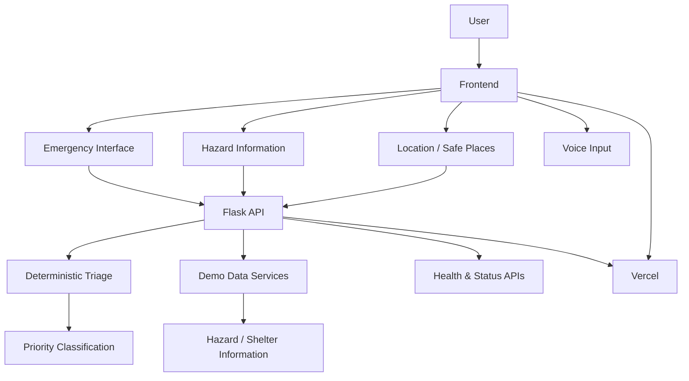

# 🌊 Aapda Saathi

### आपदा साथी — Multi-Hazard Emergency Assistance

**A problem-first emergency assistance web prototype designed around clarity, structured information and rapid action during disasters.**

 

---

## ⚠️ Important: This Is a Demonstration Project

**Aapda Saathi is a student-built prototype using simulated demonstration data.**

It is **not connected to government emergency systems, hospitals, NGOs, rescue agencies, weather authorities or real-time emergency infrastructure.**

The purpose of this project is to explore how software could be designed around emergency communication, structured reporting and rapid decision support.

**Do not use the prototype for real-world emergency decisions.**

---

# 🌏 Why Aapda Saathi?

> **Disasters do not wait for technology to be ready.**

Floods, earthquakes, droughts, tsunamis and other natural hazards are recurring realities across the Indian subcontinent and South Asia.

Their consequences extend far beyond the immediate event. Communities can face disrupted communication, damaged infrastructure, displacement, loss of livelihoods and difficulty accessing reliable information.

A major Nepal flood (2026) particularly influenced my thinking while developing this project.

Seeing how quickly a disaster can disrupt communication, mobility and access to essential information led me to a simple question:

### **What if technology could make emergency information more structured, understandable and actionable when people need it most?**

That question became the starting point for **Aapda Saathi**.

As a **second-year Computer Science & Data Science student**, I wanted to test my web-development skills through something beyond a conventional tutorial, landing page or CRUD application.

So I chose a problem-first approach:

**Real-world problem → Product idea → Engineering decisions → Working prototype → Testing → Deployment**

Aapda Saathi is my exploration of what a thoughtfully designed emergency-assistance system could look like.

It is **not a claim to solve disaster management**.

It is an attempt to engineer around a meaningful problem.

---

# 🧭 The Core Idea

During an emergency, information can become overwhelming.

People may have:

* limited connectivity
* incomplete information
* difficulty explaining what is happening
* multiple people requesting help simultaneously
* uncertainty about where to go
* difficulty understanding what information matters most

Aapda Saathi explores a different approach:

> **When a crisis becomes complicated, the information people receive should become clearer — not more complicated.**

The prototype therefore focuses on:

**Report → Understand → Prioritise → Inform → Act**

rather than simply presenting a collection of emergency information.

---

# 🌊 What Makes Aapda Saathi Different?

### 01 — Problem-first design

The interface is designed around emergency scenarios rather than around technical features.

The goal is not to demonstrate how many technologies can be connected.

The goal is to ask:

> **What information would actually help a person understand their situation?**

---

### 02 — Flood-first, but multi-hazard

Flooding is treated as the primary demonstration scenario while the system is structured around multiple hazards:

| Hazard | Demonstration Focus |
| --- | --- |
| 🌊 Flood | Rising-water / assistance reporting |
| 🏔️ Landslide | Terrain and rainfall-related risk |
| 🌪️ Cyclone / Storm | Wind and storm preparedness |
| 🌍 Earthquake | Preparedness information |
| ☀️ Heatwave | Elevated heat conditions |
| ⚡ Lightning | Weather-related risk |

This creates a foundation that can conceptually expand without redesigning the entire product.

---

### 03 — Deterministic emergency triage

Aapda Saathi does **not** allow an AI model to decide whether an emergency is critical.

The current prototype uses deterministic rules for its demonstration triage.

For example, emergency indicators can result in a higher priority classification.

This makes the behaviour:

* predictable
* inspectable
* testable
* easier to reason about

AI can assist development, but the core demonstration logic remains understandable.

---

### 04 — Thinking about the people who cannot easily report

A conventional emergency application assumes that everyone can communicate.

Real emergencies are not always that convenient.

Aapda Saathi explores ideas such as:

* silent households
* duplicate reports
* constrained connectivity
* queued requests
* location-aware assistance
* responder-oriented information

Some of these are currently represented as prototype concepts rather than production infrastructure.

---

### 05 — Designed for clarity under pressure

The visual system deliberately prioritises:

**Clarity → Hierarchy → Action**

instead of filling the screen with information.

The interface attempts to answer three questions quickly:

> **What is happening?**

> **What should I do?**

> **How can I report what I am experiencing?**

---

# 🖥️ The Experience

Aapda Saathi is structured around several connected experiences.

### 🏠 Emergency Landing Experience

The landing page introduces the system through:

* hazard awareness
* emergency actions
* geographic context
* visual signals
* responsive design
* mobile-oriented interaction

---

### 🚨 Situation Reporting

Users can describe what is happening in natural language.

The prototype then processes the message through deterministic triage logic and returns a simulated priority classification.

Example:

> “We are trapped and need help.”

The prototype can identify this as a **critical** request.

---

### 🗺️ Location & Safe-Place Concept

The project includes a demonstration model for:

* location awareness
* nearby safe places
* relief centres
* shelters
* distance information

These locations are **simulated demonstration data**.

---

### 📡 Control Centre Concept

The project also explores the responder side of emergency communication.

Instead of only thinking about the person requesting help, the system considers how structured information could eventually be surfaced to a response team.

---

# ⚙️ Core Features

* 🌊 Multi-hazard emergency interface
* 🚨 Emergency situation reporting
* 🧠 Deterministic request triage
* 🎙️ Voice-based reporting prototype
* 📍 Location-aware assistance concept
* 🗺️ Safe-place / shelter demonstration
* 🔎 Structured hazard information
* 📡 Control-centre concept
* 📴 Constrained-connectivity thinking
* 🔁 Duplicate-request detection concept
* 🏠 Silent-household detection concept
* 🌐 Responsive web interface
* 📱 Mobile-oriented emergency experience
* ♿ Reduced-motion considerations
* 🌍 Multi-language interface foundation
* 🧪 Automated backend tests
* ☁️ Production deployment on Vercel

---

# 🧠 Engineering Approach

One of the main goals of this project was not simply to make a visually impressive website.

I wanted to understand the engineering decisions behind the experience.

The architecture therefore separates:

### Frontend

A lightweight browser application built with:

* HTML
* CSS
* Vanilla JavaScript
* ES modules
* responsive UI
* Progressive Web App concepts

### Backend

A Python Flask application providing:

* API routes
* deterministic triage
* demonstration data
* health checks
* safe-place data
* request handling

### Deployment

The application is deployed using:

* Vercel
* Python serverless functions
* GitHub-based deployment workflow

---
# 🏗️ Architecture

---

# 👨‍💻 About Me

### Utkarsh Chandra Vishwakarma

**Second-Year B.Tech Computer Science & Data Science Student**

Rishihood University • India

**Software Engineering • Data Science • AI • Product Development • Entrepreneurship**

I am currently a **second-year Computer Science & Data Science student at Rishihood University**, exploring the intersection of technology, data and product thinking.

At this stage of my journey, my focus is on becoming someone who can take a problem from **idea → engineering → execution**, rather than learning technologies in isolation.

I am actively building my foundations in:

- Software Engineering
- Data Structures & Algorithms
- Data Science
- Artificial Intelligence
- Web Development
- Product Development
- Entrepreneurship

Projects like **Aapda Saathi** are part of that process.

I built this project to challenge myself to go beyond tutorials and experience the complete development cycle — understanding a problem, shaping a product idea, making technical decisions, writing the software, debugging it, testing it and deploying it.

I am still learning, but I am deliberately trying to learn by **building, breaking, questioning and improving**.

### Current Position

**B.Tech Computer Science & Data Science — Second Year**

**Rishihood University, India**

**2025–2029**

Currently focused on strengthening my technical foundations while building practical projects that combine **software, data, AI and problem-solving**.

---

# 🌱 What I Am Building Towards

My long-term goal is to become a strong technology professional capable of moving between **engineering, data, product and entrepreneurship**.

I want to build systems that are not only technically functional, but also solve problems that are meaningful to the people using them.

Aapda Saathi is one step in that journey.

 

### 🌊 Aapda Saathi

**One project. One problem. One more step forward.**

 

Built with curiosity, iteration and a problem-first mindset.

